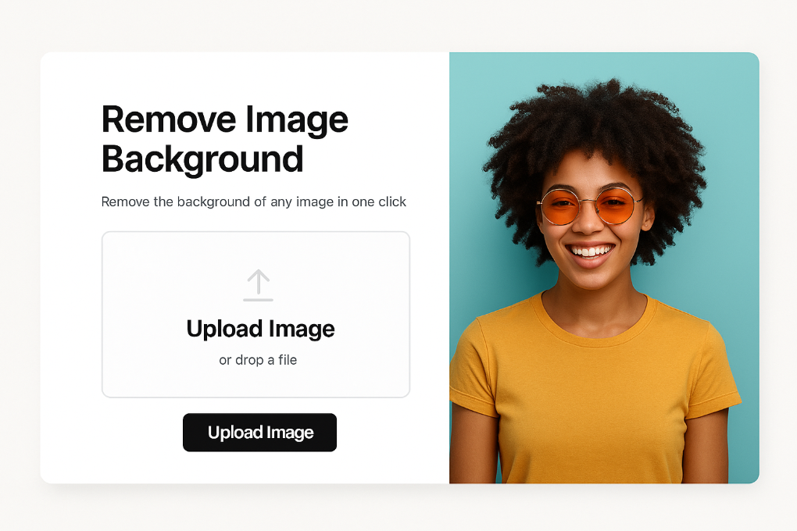

# 🖼️ RemoveBG UI


## 🚀 DEMO
### [Deploy](https://removebg-ui.vercel.app/)

## 💻 Tutorial
<a href='https://youtu.be/2O7GPaXTEcg' target='_blank'>
    
</a>

## 📋 Features
- Drag & drop interface for image uploads
- One-click background removal
- Download images with transparent backgrounds
- Responsive design (works on mobile and desktop)

## 📦 Getting Started
```
git clone https://github.com/garu2/removebgUI.git
```
```
cd removebgUI/removebg
```
```
npm install
```
```
npm run dev
```
The app will be available at `http://localhost:5173`

## ⚙️ Technologies
* [Vite.js](https://vitejs.dev/)
* [Tailwind CSS](https://tailwindcss.com/)
* [Vercel](https://vercel.com/)

## 🌐 API 
The backend API is built using [rembg](https://github.com/danielgatis/rembg), a powerful background removal tool.

API Repository: [https://github.com/garu2/removebgAPI](https://github.com/garu2/removebgAPI)
